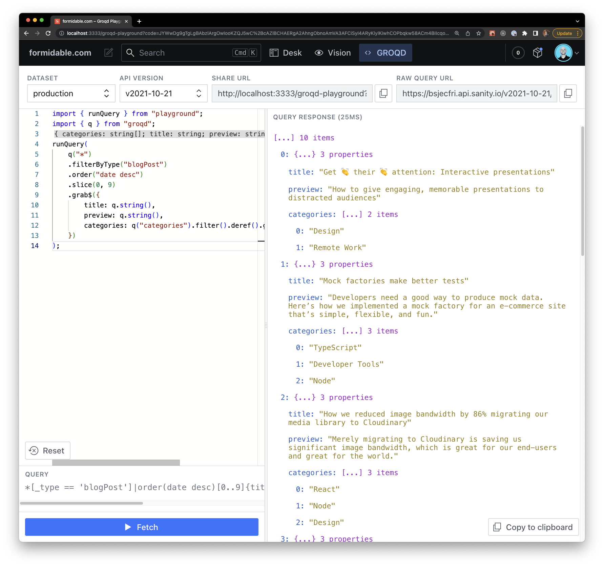

import Tabs from '@theme/Tabs';
import TabItem from '@theme/TabItem';

# Groqd Playground (Plugin)

Groqd Playground is a plugin for Sanity Studio for testing groqd queries, featuring:

- a TypeScript editor experience with syntax/type highlighting;
- parsed response and error messages for when responses fail to pass Zod validation;
- dataset/api version switchers.



## Installation

In your Sanity Studio project, install `groqd-playground` using your favorite package registry tool.

<Tabs>
<TabItem value="npm" label="NPM">

```sh
npm install groqd-playground
```

</TabItem>
<TabItem value="yarn" label="Yarn">

```sh
yarn add groqd-playground
```

</TabItem>
<TabItem value="pnpm" label="pnpm">

```sh
pnpm add groqd-playground
```

</TabItem>
</Tabs>

:::note
**The playground tool has the following peer dependencies**, most/all of which you should already have installed in a Sanity project:

```text
sanity @sanity/ui @sanity/icons styled-components
```
:::

## Configuration

Once installed, just add the groqd playground tool to your list of Sanity plugins:

```ts
import { defineConfig } from "sanity";
import { groqdPlaygroundTool } from "groqd-playground";

export default defineConfig({
	/* ... */
  plugins: [groqdPlaygroundTool()],
});
```

The `groqdPlaygroundTool` method takes a configuration option as its sole, optional argument with the following options.

| key | description | default |
| --- | --- | --- |
| `name` | Name of the plugin | `"groqd-playground"` |
| `title` | Title to show in navbar of Studio | `"GROQD"` |
| `icon` | Icon to show in navbar of Studio | `CodeIcon` |
| `defaultDataset` | Default dataset to use in playground | `"production"` |
| `defaultApiVersion` | Default API version to use in playground | `"v2021-10-21"` |

## How to use

TODO:
