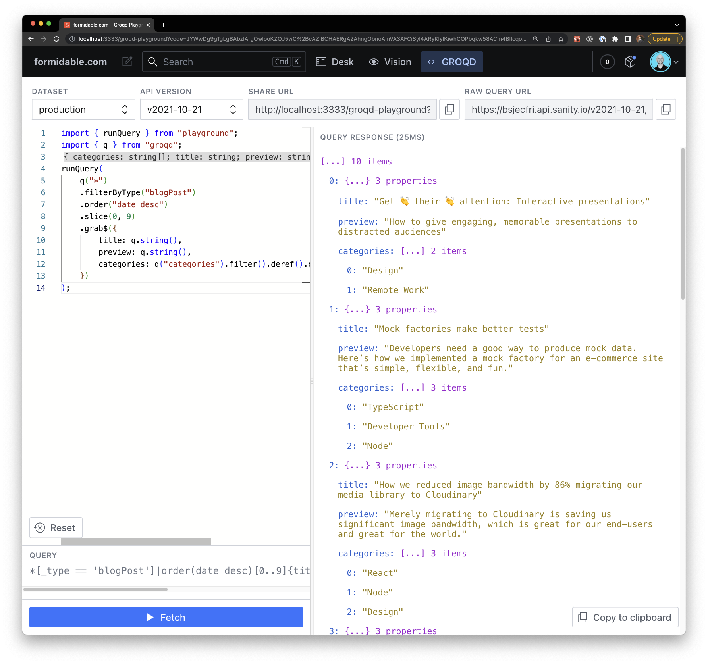

# Introduction

[](https://commerce.nearform.com/open-source/groqd)


`groqd` is a schema-unaware, runtime-safe query builder for [GROQ](https://www.sanity.io/docs/groq). **The goal of `groqd` is to give you (most of) the flexibility of GROQ, with the runtime/type safety of [Zod](https://github.com/colinhacks/zod) and TypeScript.**

`groqd` works by accepting a series of GROQ operations, and generating a query to be used by GROQ and a Zod schema to be used for parsing the associated GROQ response.

An illustrative example:

```ts
import { q } from "groqd";

// Get all of the Pokemon types, and the Pokemon associated to each type.
const { query, schema } = q("*")
  .filter("_type == 'poketype'")
  .grab({
    name: q.string(),
    pokemons: q("*")
      .filter("_type == 'pokemon' && references(^._id)")
      .grab({ name: q.string() }),
  });

// Use the schema and the query as you see fit, for example:
const response = schema.parse(await sanityClient.fetch(query));

// At this point, response has a type of:
// { name: string, pokemons: { name: string }[] }[]
// 👆👆
```

Since the primary use-case for `groqd` is actually executing GROQ queries and validating the response, we ship a utility to help you make your own fetching function. Here's an example of wrapping `@sanity/client`'s fetch function:

```ts
import sanityClient from "@sanity/client";
import { q, makeSafeQueryRunner } from "groqd";

const client = sanityClient({
  /* ... */
});
// 👇 Safe query runner
export const runQuery = makeSafeQueryRunner((query) => client.fetch(query));

// ...

// 👇 Now you can run queries and `data` is strongly-typed, and runtime-validated.
const data = await runQuery(
  q("*").filter("_type == 'pokemon'").grab({ name: q.string() }).slice(0, 150)
);
// data: { name: string }[]
```

Using `makeSafeQueryRunner` is totally optional; you might find using `q().schema` and `q().query` in your own abstractions works better for you.

## The Playground

We also provide a [Vision](https://www.sanity.io/docs/the-vision-plugin)-like Sanity Studio tool for experimenting with groqd queries and running them against your actual dataset.



The playground is a drop-in Sanity plugin, and is an easy way to test out groqd within your dataset. See [the playground docs](./groqd-playground.mdx) for more information on the playground.

## Why `groqd`? 🤷‍

GROQ's primary use is with [Sanity](https://www.sanity.io/). Sanity's Content Lake is fundamentally unstructured, and GROQ (and Sanity's GROQ API) do not have any sort of GraqhQL-like type contracts.

We'd love to see advanced codegen for Sanity and GROQ. However, the end-result would likely not be as runtime type-safe as some might desire due to the flexibility of Sanity's Content Lake and the GROQ language in general.

The goal of `groqd` is to work around these constraints by allowing _you_ to specify the runtime data schema for your query so that your data's type is _runtime safe_ – not just theoretically, but empirically.
